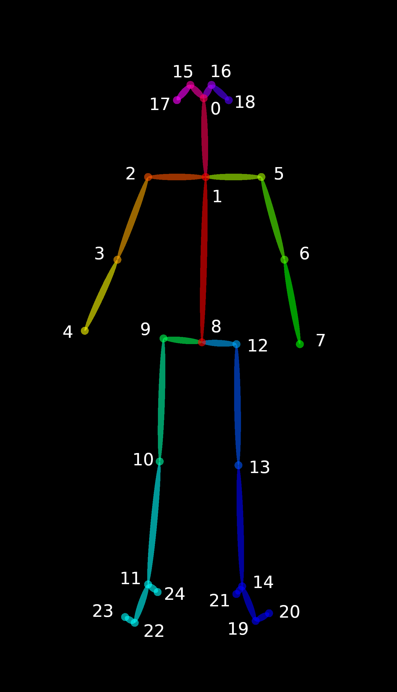

# My build for Openpose

---
- [My build for Openpose](#my-build-for-openpose)
  - [Usage](#usage)
  - [Analysis](#analysis)
  - [Acknowledge](#acknowledge)

## Usage

The compiled executable files are stored in [bin](./bin) folder. 
Now, it contains only the example bin file [openpose.bin](./bin/openpose.bin).

The [examples](./examples) and [models](./models) are the files downloaded from the website.

The 25 key points in the Openpose are in the table

| index | order | joint name | joint name in chs. |
| ----- | ----- | ---------- | ------------------ |
| 0     | 0     | Nose       | 鼻子               |
| 1     | 1     | Neck       | 脖子               |
| 2     | 2     | RShoulder  | 右肩               |
| 3     | 3     | RElbow     | 右手肘             |
| 4     | 4     | RWrist     | 右手腕             |
| 5     | 5     | LShoulder  | 左肩               |
| 6     | 6     | LElbow     | 左手肘             |
| 7     | 7     | LWrist     | 左手腕             |
| 8     | 8     | MidHip     | 中臀               |
| 9     | 9     | RHip       | 右臀               |
| 10    | 10    | RKnee      | 右膝盖             |
| 11    | 11    | RAnkle     | 右脚踝             |
| 12    | 12    | LHip       | 左臀               |
| 13    | 13    | LKnee      | 左膝盖             |
| 14    | 14    | LAnkle     | 左脚踝             |
| 15    | 15    | REye       | 右眼               |
| 16    | 16    | LEye       | 左眼               |
| 17    | 17    | REar       | 右耳               |
| 18    | 18    | LEar       | 左耳               |
| 19    | 19    | LBigToe    | 左大拇指           |
| 20    | 20    | LSmallToe  | 左小拇指           |
| 21    | 21    | LHeel      | 左脚跟             |
| 22    | 22    | RBigToe    | 右大拇指           |
| 23    | 23    | RSmallToe  | 右小拇指           |
| 24    | 24    | RHeel      | 右脚跟             |
| 25    | 25    | Background | 背景               |

## Analysis

The [analysis](./analysis/) folder contains simple scripts that uses the frames in json.

- The [analysis.py](./analysis/analysis.py) script display the peoples in the given frame;
- The [analysis2.py](./analysis/analysis2.py) script parse the frames, and save the position of the joints into the [data.csv](./analysis/data.csv).

## Acknowledge

The project is build from the Openpose,
the websites are

- [gitcode](https://gitcode.net/mirrors/CMU-Perceptual-Computing-Lab/openpose?utm_source=csdn_github_accelerator#quick-start-overview "gitcode")

- [github](https://github.com/CMU-Perceptual-Computing-Lab/openpose "github")